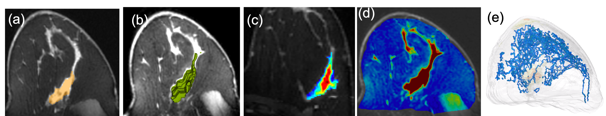
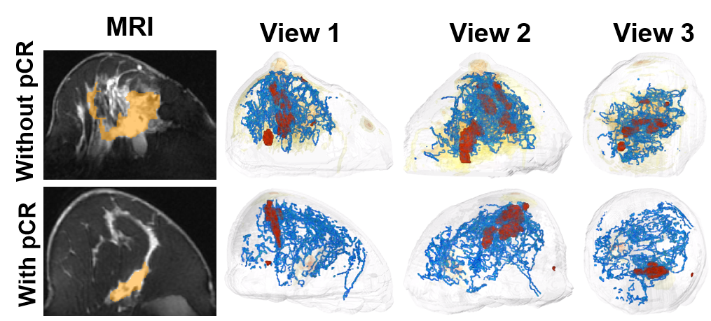

# TopoTxR: A Topological Biomarker forPredicting Treatment Response in Breast Cancer #

**Fan Wang, Saarthak Kapse, Steven Liu, Prateek Prasanna, Chao Chen, IPMI 2021.**  
Archive page (https://arxiv.org/abs/2105.06049)  
Paper (https://arxiv.org/pdf/2105.06049.pdf)

Characterization of breast parenchyma on dynamic contrastenhanced magnetic resonance imaging (DCE-MRI) is a challenging
task owing to the complexity of underlying tissue structures. Current quantitative approaches, including radiomics and deep learning models, do not explicitly capture the complex and subtle parenchymal structures, such as fibroglandular tissue. In this paper, we propose a novel method to direct a neural network’s attention to a dedicated set of voxels surrounding biologically relevant tissue structures. By extracting multi-dimensional topological structures with high saliency, we build a topology-derived biomarker, TopoTxR. We demonstrate the efficacy of TopoTxR in predicting response to neoadjuvant chemotherapy in breast cancer. Our qualitative and quantitative results suggest differential topological behavior of breast tissue on treatment-na¨ıve imaging, in patients who respond favorably to therapy versus those who do not.

 

 

 

 

TopoTxR is tested under Windows 10 and ran on jupyter notebook with pytorch support.

### 1. Instructions ###
Before running the program, here are a few parameters you might want to change:
Archpool/return_settings():
- branch_name: the name of the pytorch log folder to put saved models
- continue_model: train from the saved checkpoint
- model_step: if continue_model is True, specifiy the step you want to to continue training from
- save_path: the path to put the pytorch log folder
- data_path: path to your training folder 1
- data_path2: path to your training folder 2

Go to Examples.ipynb and hit run button.

### Citation ###
    @inproceedings{WangKLPC21,
      title = {TopoTxR: A Topological Biomarker for Predicting Treatment Response in Breast Cancer},
      author = {Fan Wang and Saarthak Kapse and Steven Liu and Prateek Prasanna and Chao Chen},
      year = {2021},
      doi = {10.1007/978-3-030-78191-0_30},
      url = {https://doi.org/10.1007/978-3-030-78191-0_30},
      researchr = {https://researchr.org/publication/WangKLPC21},
      cites = {0},
      citedby = {0},
      pages = {386-397},
      booktitle = {Information Processing in Medical Imaging - 27th International Conference, IPMI 2021, Virtual Event, June 28-June 30, 2021, Proceedings},
      editor = {Aasa Feragen and Stefan Sommer and Julia A. Schnabel and Mads Nielsen},
      volume = {12729},
      series = {Lecture Notes in Computer Science},
      publisher = {Springer},
      isbn = {978-3-030-78191-0},
    }
